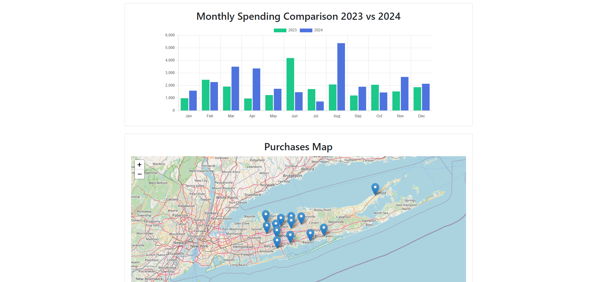

# Credit Card Spending Analyzer

The Spending Analyzer App is a Flask web application designed to analyze and visualize spending data from CSV files. It provides various plots to help users understand their spending patterns across different credit cards. Currently looks back at 2023 and 2024.

CSV files can be stored in a `reports` folder located in same dir as script.

## CSV File Layout
Ensure that the CSV files contain a 'Transaction Date', 'Category', and 'Amount' column.

Sample CSV:
| Transaction Date | Category      | Amount  |
| ---------------- |:-------------:| -------:|
| 12/07/2024       | Shopping      | 260.10  |
| 11/21/2024       | Food & Drink  |   12.45 |
| 10/14/2024       | Travel        |  156.21 |




## Data Visuals
- **Total Spending Comparison**: Visualizes total spending for the years 2023 and 2024.
- **Spending by Category**: Displays a pie chart of spending categorized by the top 5 categories and an 'Other' category.
- **Monthly Spending Comparison**: Compares monthly spending between the two years.
- **Purchase Map**: Shows geographic locations in New York where purchases were made.

## Transactions
The application includes a detailed transaction history page. Users can view all their transactions in a tabular format, sorted by date range, description, category, or amount. This feature helps users keep track of their spending habits and identify any unusual transactions.

## Forecasting
The application utilizes the Prophet forecasting model to predict spending amounts for the upcoming 12 months. This feature provides users with insights into future spending trends based on historical data.


## House Savings Calculator
The application includes a House Savings Calculator feature that helps users estimate the amount of money they need to save for a house down payment. Users can input their target house price, desired down payment percentage, and current savings. The calculator will then provide a savings plan, including the monthly savings required to reach the goal within a specified time frame. This feature assists users in planning and achieving their homeownership goals.


## Run
```
python spending_analyzer.py
```

Open your web browser and navigate to `http://127.0.0.1:5000` to view the application.

## License
This project is licensed under the MIT License. See the LICENSE file for details.